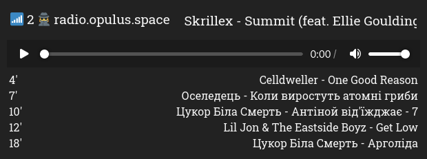

# icecast_radio_player

> "Web interface for icecast radio."

## How to host?

1. Clone repo.
2. Copy `.env.examle` to `.env`.
3. Write uor own settings to `.env`.
4. Up `docker-compose` file. (port `8050`)
5. Setup reverse proxy.

## Used technologies

- Flask
- Celery
- Redis
- JS
- Docker
- Caddy